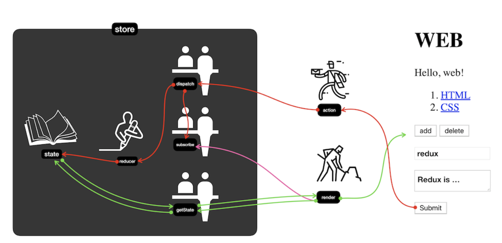

# React-Redux Tutorial
React-Redux [생활코딩 강좌](https://www.youtube.com/watch?v=fkNdsUVBksw&list=PLuHgQVnccGMDuVdsGtH1_452MtRxALb_7&index=1)임  
크게 3번의 절차를 거쳐 React-Redux 도입을 배우게 된다.  
##### 작성된 설명과 그림의 출처는 [생활코딩](https://opentutorials.org/course/1)입니다.

##  # Redux 이해
 
### **state**
    데이터를 저장하는 장소 

### **reducer**
    state에 값을 기록하는 기록자, store를 생성할 때 정의한다.

### **subscribe**
    state가 변경됬을 때 호출될 함수들을 등록하고, state가 변경되었을 때 등록된 함수들을 호출해준다.

### **action**
    사용자의 조작에 의해 발생한 이벤트로, 타입과 데이터를 갖고있는 객체다.

### **dispatch**
    action을 store에 전달하기 위한 행위라고 생각하면 된다.  
    action을 받는 곳으로써, reducer를 호출하고, subscribe에게 변경된 사실을 알린다.

### **getState**
    state의 값을 얻어올 때 사용한다.

 
### redux 규칙
**모든 변화(reducer)는 순수함수로 구성한다**
- 모든 함수는 파라미터에만 의존한다, 같은 파라미터 = 같은 결과
- 외부 네트워크나, 데이터베이스에 직접 접근하지않는다. (다른 결과가 return 되거나, 요청자체가 실패할 수 있다.)
- new Date() or Math.random() 함수를 사용해선 안된다. (다른결과가 return)

   

## # Without Redux
---

props를 통한 컴포넌트간의 데이터 통신

### **장점** 
- 별도의 패키지를 install할 필요 없다
### **단점**
- 컴포넌트관계의 depth가 깊어질수록 데이터전달이 점점 힘들어진다
---
   

## # With Redux
---
쌩 Redux를 통한 컴포넌트간의 데이터 통신

### **장점**
- 컴포넌트간의 데이터 공유가 편리하다
### **단점**
- 컴포넌트의 재사용성을 높이기 위해  Presentaional Component와 Container Component의 분리가 필요하다
- root 컴포넌트에서 Presentational Component에 prop을 전달하고 싶을경우,   Container Component를 거쳐야하는 번거로움이 발생한다.
- 사용하는 모든 곳에서 store를 import 해야한다.
---
  

## # With React Redux
---
Redux를 React에서 편하게 사용할 수 있도록 고안된  
[React-Redux](https://redux.js.org/basics/usage-with-react)를 이용한 데이터 통신
### **장점**
- Redux의 장점과 Container Component를 생성/관리하던 번거로움을 줄여준다.
- Store import를 한번만 하면 된다.
### **단점**
- 러닝커브
- react에서 밖에 못씀

### 주요 메소드 or 컴포넌트
- **Provider Component** : 자식 컴포넌트들이 store를 사용할 수 있게 해준다.
- **[Connect Method](https://gist.github.com/gaearon/1d19088790e70ac32ea636c025ba424e)**: Wrapper(=Container) Component를 만들어준다.
    - 1번째 인자([mapStateToProps](https://react-redux.js.org/using-react-redux/connect-mapstate)): Redux의 State를 React의 Props로 매핑해주는 함수
    - 2번째 인자([mapDispatchToProps](https://react-redux.js.org/using-react-redux/connect-mapdispatch)): Redux의 Dispatch를 React의 Props로 매핑해주는 함수

---
